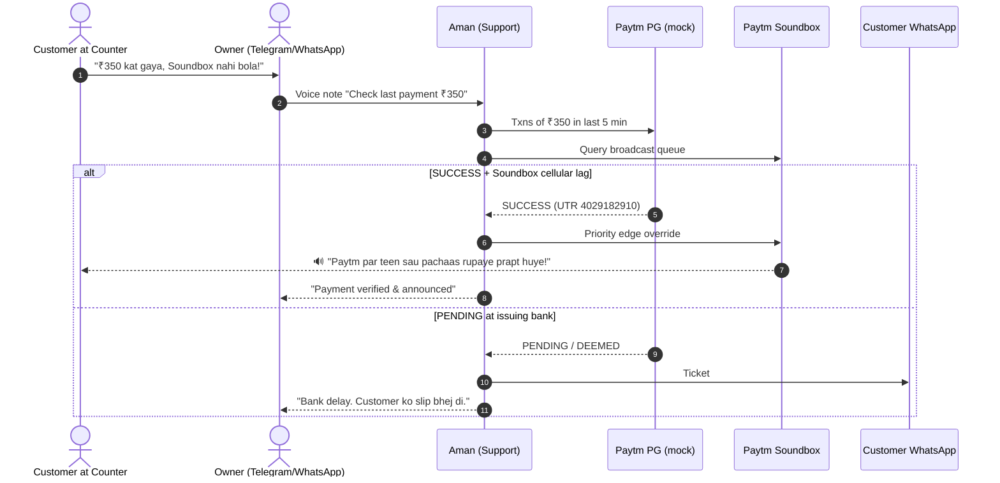
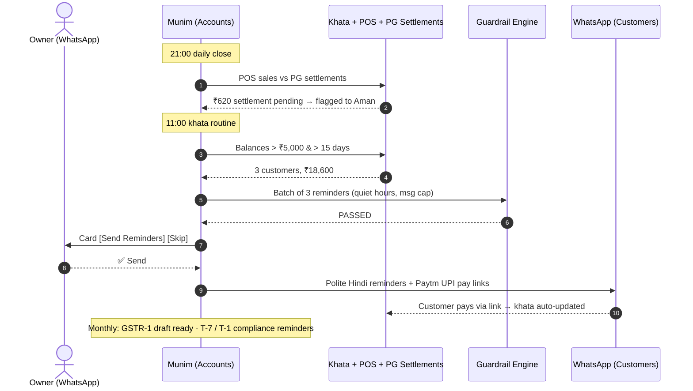

# Track 3: Bharat Business — AI for MSMEs & Workers
# Cortex: The AI Back-Office for Every Bharat MSME, Run from WhatsApp
*A standalone autonomous-workforce platform: an in-store desktop command center, a hired team of AI employees, a No-Code Agent Studio, and zero-install WhatsApp/Telegram remote control for owners, workers, suppliers and customers.*

---

## 1. Executive Summary & Track 3 Mandate

### The Hackathon Problem Statement
> *"Track 3 — Bharat Business: AI for MSMEs & Workers. Build AI that helps India's businesses and workforce do more with less.
> Ideas: AI employees, WhatsApp business agents, accounting, sales, procurement, customer support, operations, and compliance."*

### The Reality of a Bharat MSME
A typical sweet shop, kirana or restaurant owner is simultaneously the salesperson, accountant, purchase manager, HR department, customer-support desk and compliance officer. They run it all from a notebook, a phone and memory:
- **Udhaar (credit) leaks**: ₹30–50k stuck in the khata, chased awkwardly or not at all.
- **Invisible revenue loss**: a stockout at 5:45 PM silently costs the evening peak.
- **Payment panics**: "Paisa kat gaya, Soundbox nahi bola" fights at the counter.
- **Procurement by phone calls**: no price comparison, no records.
- **Staff chaos**: attendance, advances and salary in a diary; workers have no record of what they're owed.
- **Compliance anxiety**: GST, FSSAI and licence deadlines missed → penalties.

### Our Answer: Cortex
**Cortex gives every MSME a hired team of AI employees that actually do the back-office work** — detect, decide, draft and execute — while the owner simply taps **✅ Approve** on WhatsApp.

1. **The In-Store Command Center (Desktop)**: A standalone app on the counter laptop with an embedded zero-install database. It runs the AI workforce, connects to Paytm hardware (Soundbox, PG, POS), and includes a **No-Code Agent Studio** to hire vertical-specific teammates.
2. **The Zero-Install Remote (WhatsApp & Telegram)**: Owners, workers, suppliers and customers all interact through the chat apps they already use.
   - **Voice notes** in Hindi/Hinglish (*"Munim, is mahine kitna udhaar baaki hai?"*).
   - **1-tap interactive buttons** for every money decision (`[✅ Approve]`, `[❌ Reject]`).
   - **Audio briefings** and **Soundbox announcements** at the counter.
3. **No app-store friction**: Onboard in 10 seconds with a QR scan on the laptop screen.

### Problem-Statement Coverage Matrix

| Brief Area | Cortex Agent | What It Does Autonomously | Measurable KPI |
| :--- | :--- | :--- | :--- |
| **AI employees** | Whole roster + Studio | Five hired teammates + unlimited custom hires | Hours saved / week |
| **WhatsApp business agents** | Channel gateway | Every agent works through WhatsApp/Telegram cards & voice | % actions done from phone |
| **Sales** | 🎯 Priya | Dip detection → win-back campaigns → attribution | ₹ recovered revenue |
| **Customer support** | 🛡️ Aman | UPI dispute reconciliation, Soundbox override, customer slips | Resolution time (sec), disputes auto-cleared |
| **Procurement** | 📦 Vikram | Low-stock forecast, supplier RFQ over WhatsApp, PO drafting | Stockouts avoided, ₹ saved vs last price |
| **Operations** | 📦 Vikram + 👷 Meera | Stock cover, shift reminders, attendance | Stockout hours, absent-shift alerts |
| **Accounting** | 📒 Munim | Settlement ↔ sales reconciliation, khata tracking, udhaar recovery | ₹ udhaar recovered, mismatches caught |
| **Compliance** | 📒 Munim | GSTR-1 draft, GST/FSSAI/licence calendar and reminders | Deadlines met, penalty ₹ avoided |
| **Workers** | 👷 Meera | WhatsApp check-in, salary & advance ledger, UPI payday, voice payslips | On-time payouts, disputes over pay |

```
 +---------------------------------------------------------------------------------------------------------------+
 |                         PRODUCT 1: THE IN-STORE COMMAND CENTER ("CORTEX DESKTOP")                              |
 |                (Standalone app on the counter laptop — an AI back-office with an embedded database)            |
 |                                                                                                               |
 |  [ 👥 Workforce Roster ]   [ ⚡ Live Task Stream ]   [ 📒 Khata & GST ]   [ ✨ Agent Studio ]   [ 🔊 Soundbox ] |
 |  • Priya · Aman · Vikram   • Transparent reasoning  • Udhaar ledger      • Hire in 30 sec     • Audio hook     |
 |  • Munim · Meera · Custom  • Every step audited     • Compliance dates   • Retail templates   • Hindi voice    |
 +---------------------------------------------------------------------------------------------------------------+
                                                        ▲
                      ┌─────────────────────────────────┴─────────────────────────────────┐
                      │                CORTEX CHANNEL GATEWAY                             │
                      │    WhatsApp Cloud API + Telegram Long-Polling + Offline Simulator │
                      └─────────────────────────────────┬─────────────────────────────────┘
                                                        ▼
 +---------------------------------------------------------------------------------------------------------------+
 |                         PRODUCT 2: ZERO-INSTALL REMOTE (WHATSAPP & TELEGRAM)                                   |
 |  👤 Owner: approvals, voice queries   👷 Workers: check-in, payslips   🚚 Suppliers: RFQs & POs   🧑 Customers: |
 |                                                                                  vouchers, slips, udhaar links |
 +---------------------------------------------------------------------------------------------------------------+
```

---

## 2. Product 1: The In-Store Command Center ("Cortex Desktop")

The laptop is **not a background server** — it is a complete desktop command center built in Paytm's visual language (`Paytm Dark Navy #002970`, `Paytm Sky Blue #00BAF2`, `Card White #FFFFFF`). A left nav rail switches between **Command Center · Khata & Accounts · Stock & Purchase · Staff · Studio · Channels**.

```
+------+----------------------------------------------------------------------------------------------------------------+
| NAV  |  paytm for business | Cortex                        [📱 WhatsApp: CONNECTED] [✈️ Telegram: CONNECTED] [⚙️]       |
|      +----------------------------------------------------------------------------------------------------------------+
| 🏠   |  🏪 RAMESH SWEETS & RESTAURANT | GSTIN: 07AAAAA0000A1Z5 | Paytm Soundbox: ACTIVE (🔋 88%)                         |
| 📒   |                                                                                                                |
| 📦   |  👥 YOUR AI WORKFORCE                                                               [ + Hire New Custom Agent ] |
| 👷   |  +----------------+ +----------------+ +----------------+ +----------------+ +----------------+ +--------------+ |
| ✨   |  | 🎯 Priya       | | 🛡️ Aman        | | 📦 Vikram      | | 📒 Munim       | | 👷 Meera       | | 💊 Expiry    | |
| 📡   |  | Sales          | | Support & UPI  | | Stock & Purch. | | Khata & GST    | | Staff & Pay    | | (Custom)     | |
|      |  | MONITORING     | | READY          | | PO PENDING     | | RECONCILED     | | ACTIVE         | | ACTIVE       | |
|      |  | ₹14,800 (Wk)   | | 18 UPI Holds   | | 2 Low SKUs     | | ₹9,200 udhaar  | | 5/6 present    | | 420 SKUs     | |
|      |  +----------------+ +----------------+ +----------------+ +----------------+ +----------------+ +--------------+ |
|      |                                                                                                                |
|      |  +--------------------------------------------------------+  +---------------------------------------------+ |
|      |  | ⚡ LIVE WORKFORCE ACTIVITY STREAM (TASK DAG)           |  | 📱 REMOTE CONTROL LIVE MIRROR (WHATSAPP)    | |
|      |  | [07:02] 🎯 Priya detected evening revenue dip (-38%)   |  |  Ramesh's Phone: +91 98765-XXXXX            | |
|      |  | [07:03] 📦 Vikram traced root cause: Butter Paneer OOS |  |  "10% Recovery Voucher for 28 Regulars"     | |
|      |  | [07:04] 🎯 Priya isolated 28 affected regulars         |  |  Cost ₹140 | Projected ₹3,200 | Margin Safe | |
|      |  | [07:05] 🛡️ Guardrail: 10% discount, 35% net — PASSED  |  |  [✅ Approve & Send]  [❌ Reject]           | |
|      |  | [07:06] 📲 1-Tap Card sent to WhatsApp                 |  |                                             | |
|      |  | [07:07] 📥 Callback: APPROVE CLICKED                   |  |  Status: EXECUTED VIA WHATSAPP CALLBACK     | |
|      |  | [07:07] 🚀 28 vouchers dispatched                      |  |                                             | |
|      |  | [09:05] 👷 Meera: 5/6 staff checked in                 |  |                                             | |
|      |  | [11:00] 📒 Munim drafted 3 udhaar reminders (₹18,600)  |  |                                             | |
|      |  +--------------------------------------------------------+  +---------------------------------------------+ |
|      |                                                                                                                |
|      |  📈 Today's UPI: ₹18,420 | AI Revenue: ₹3,850 (21%) | Disputes Cleared: 4 | Udhaar: ₹9,200 | Saved: 11.5 h |  |
|      |     Compliance next due: GSTR-1 in 14 days                                                                     |
+------+----------------------------------------------------------------------------------------------------------------+
```

---

## 3. Product 2: Zero-Install Remote via WhatsApp & Telegram

Instead of asking a merchant (or their staff) to install an `.apk`, we meet everyone where they already are. Cortex serves **four audiences** on the same channels:

| Audience | What they do on WhatsApp/Telegram |
| :--- | :--- |
| 👤 **Owner** | Receives 1-tap decision cards, asks questions by voice, gets daily audio briefings |
| 👷 **Workers** | Send "haazir" to check in, get shift reminders, receive Hindi voice payslips and advance balances |
| 🚚 **Suppliers** | Receive RFQs, reply with prices in free text, receive confirmed POs |
| 🧑 **Customers** | Receive win-back vouchers, dispute slips and polite udhaar reminders with UPI pay links |

### 3.1 Owner Experience (WhatsApp — Primary Remote)
```
+-------------------------------------------------------------+
| 🟢 WhatsApp                        Cortex Teammates 💬       |
+-------------------------------------------------------------+
| [07:01 AM] 🎯 Priya (Sales):                                |
| "Namaste Ramesh Ji! ☀️                                       |
|  Kal sham 6-9 PM ke peak hours me bikri 38% down thi        |
|  (₹4,800 ka deficit).                                       |
|  🔍 Root Cause: 'Butter Paneer' 5:45 PM pe out-of-stock.    |
|  👥 28 regular customers bina khareede chale gaye.          |
|  Offer: 10% off | Cost: ₹140 | Projected: ₹3,200            |
|  (Margin Safe: 35% net). Bhej de?"                          |
|  [ ✅ APPROVE & SEND ]      [ ❌ REJECT ]                    |
|                                                             |
| [07:03 AM] Ramesh: [Taps '✅ APPROVE & SEND']               |
| [07:03 AM] 🎯 Priya: "Done! 28 vouchers bhej diye. 🔊"      |
|                                                             |
| [11:00 AM] 📒 Munim (Accounts):                             |
| "3 customers ka udhaar ₹5,000 se zyada, 15+ din purana:     |
|  Gupta Caterers ₹8,400 · Verma Ji ₹5,600 · Rana ₹4,600...   |
|  Polite reminder + Paytm UPI link bhej du?"                 |
|  [ ✅ SEND REMINDERS ]      [ ❌ SKIP ]                      |
|                                                             |
| [06:00 PM] 📦 Vikram (Purchase):                            |
| "Paneer kal subah khatam ho jayega. 3 suppliers ke rate:    |
|  Sharma Dairy ₹310/kg ✅ · Fresh Farms ₹325 · City ₹340.     |
|  12 kg order = ₹3,720. PO bhej du Sharma Dairy ko?"         |
|  [ ✅ PLACE ORDER ]         [ ❌ REJECT ]                    |
+-------------------------------------------------------------+
```

### 3.2 Worker Experience (WhatsApp — Meera)
```
+-------------------------------------------------------------+
| 🟢 WhatsApp                        Ramesh Sweets Staff 👷    |
+-------------------------------------------------------------+
| [08:52 AM] Sunita: haazir                                   |
| [08:52 AM] 👷 Meera: "Good morning Sunita ji! ✅ 8:52 AM    |
|             check-in ho gaya. Aaj ki shift: 9 AM - 6 PM."   |
|                                                             |
| [01 Oct] 👷 Meera: 🔊 Voice Note (0:14) ▶️ ılılıllı          |
| "Sunita ji, is mahine aapki salary ₹18,000, 26 din haazir,  |
|  koi advance baaki nahi. ₹18,000 aapke UPI me bhej diye."   |
+-------------------------------------------------------------+
```

### 3.3 Supplier Experience (WhatsApp — Vikram)
```
| 📦 Vikram → Sharma Dairy: "Namaste! Ramesh Sweets ko kal 7 AM tak 12 kg paneer chahiye. Aapka rate?" |
| Sharma Dairy: "310 per kg, subah 7 baje delivery"                                                  |
| 📦 Vikram → Sharma Dairy: "✅ PO-07 confirmed: 12 kg @ ₹310 = ₹3,720. Delivery kal 7 AM."           |
```

### 3.4 Telegram Experience (Power-User Console & Bulletproof Demo Fallback)
```
+-------------------------------------------------------------+
| ✈️ Telegram                     @CortexStoreBot              |
+-------------------------------------------------------------+
| Ramesh: 🎙️ Voice (0:04): "Check last payment ₹350"          |
| 🛡️ Aman: "🔍 Checking Paytm PG & Soundbox logs...           |
|  ✅ PAYMENT VERIFIED — TXN-9021-88 · ₹350 · rahul@paytm      |
|  UTR 4029182910 · SUCCESS                                   |
|  ⚠️ Soundbox cellular delay detected. Overriding now..."    |
|  🔊 Soundbox Alert Triggered on Store Counter!               |
|  [ 🔄 Refresh Ledger ]  [ 🧾 Send Slip to Customer ]         |
|                                                             |
| Ramesh: /status                                             |
| 🤖 Priya: Monitoring · Aman: 4 resolved today ·             |
|    Vikram: PO-07 pending · Munim: GSTR-1 draft ready ·      |
|    Meera: 5/6 present                                       |
+-------------------------------------------------------------+
```

---

## 4. The No-Code Agent Studio ("Hire a Teammate")

Every business has vertical-specific headaches. The Studio lets the merchant hire a new teammate from a template or a natural-language prompt — typed on the laptop or sent as a WhatsApp voice note.

```
+---------------------------------------------------------------------------------------------------+
|  CORTEX AGENT STUDIO: "HIRE A NEW TEAMMATE"                                                       |
+---------------------------------------------------------------------------------------------------+
|  Option A: Templates                                                                              |
|  [ 💊 Pharmacy Expiry Sentinel ]  [ 🍽️ Rush-Hour Reconciler ]  [ 👗 Apparel Slow-Mover ]           |
|  Batch expiries, supplier credit   Delivery commissions vs     SKUs unsold for 21 days →          |
|  claims, clearance flags.          walk-in sales at peak.      weekend bundle offers.             |
|                                                                                                   |
|  Option B: Prompt-to-Agent                                                                        |
|  "Track my wholesale khata. If a customer's balance exceeds ₹5,000 for more than 15 days, draft  |
|   a polite WhatsApp reminder with a Paytm UPI link. Never send messages after 8 PM."              |
|  [ ✨ Generate Teammate ]                                                                         |
|                                                                                                   |
|  Compiled Spec (validated):                                                                       |
|  • Name: "Rohan - Udhaar Recovery Agent"   • Trigger: Daily 11:00 AM routine                      |
|  • Data: Khata ledger (read-only)          • Tools: WHATSAPP_DRAFT, PAYTM_UPI_LINK_GENERATOR      |
|  • Guardrails: ≤ 50 msgs/day; quiet hours 20:00–08:00; merchant approval required                  |
|  [ ✅ Confirm & Hire Teammate ]                                                                   |
+---------------------------------------------------------------------------------------------------+
```

The compiler **cannot** grant a tool outside the sandboxed catalogue, remove the approval gate on money actions, or exceed store-level caps. The LLM drafts the spec; the zod schema and guardrail engine decide whether it's valid.

---

## 5. Core Workflows: Measurable Outcomes

### Workflow 1: Autonomous Sales Recovery (Priya — Sales)
```mermaid
sequenceDiagram
    autonumber
    actor Merchant as Owner (WhatsApp)
    participant Cortex as Cortex Runtime
    participant Priya as Priya (Sales)
    participant Vikram as Vikram (Stock)
    participant Guard as Guardrail Engine
    participant WA as WhatsApp Cloud API
    participant Soundbox as Paytm Soundbox

    Note over Cortex: 07:00 AM scheduled routine
    Cortex->>Priya: Run daily revenue audit
    Priya->>Cortex: Hourly sales vs 30-day baseline
    Note over Priya: 6–9 PM dip: -38% (₹4,800 deficit)
    Priya->>Vikram: Root-cause check
    Vikram-->>Priya: Butter Paneer OOS at 5:45 PM (replenished)
    Priya->>Cortex: Cohort during stockout window → 28 regulars
    Priya->>Guard: Propose 10% voucher, cost ₹140
    Note over Guard: 45% − 10% = 35% net ≥ floor; spend ≤ cap → PASSED
    Priya->>WA: Signed decision card [Approve] [Reject]
    WA-->>Merchant: Owner taps ✅ Approve & Send
    WA-->>Cortex: Button webhook → decision executed
    Cortex->>WA: 28 personalised vouchers (unique codes)
    Cortex->>Soundbox: "28 regular customers ko offer bhej diya gaya hai!"
    Note over Cortex: 48 h attribution: 18 of 28 redeem → ₹2,900 recovered
```

### Workflow 2: UPI Dispute Resolution (Aman — Customer Support)


### Workflow 3: Khata, Reconciliation & Compliance (Munim — Accounting & Compliance)


### Workflow 4: Autonomous Procurement (Vikram — Procurement & Operations)
```mermaid
sequenceDiagram
    autonumber
    actor Owner as Owner (WhatsApp)
    participant Vikram as Vikram (Stock & Purchase)
    participant POS as POS Stock (mock)
    participant Sup as 3 Suppliers (WhatsApp)
    participant Guard as Guardrail Engine

    Note over Vikram: 18:00 stock routine
    Vikram->>POS: 7-day velocity & current stock
    POS-->>Vikram: Paneer cover < 1 day → reorder 12 kg
    Vikram->>Sup: RFQ to Sharma Dairy, Fresh Farms, City Wholesale
    Sup-->>Vikram: Free-text replies → parsed quotes (₹310 / ₹325 / ₹340)
    Vikram->>Guard: PO ₹3,720 (≤ cap; +1.6% vs last price ≤ 8%)
    Guard-->>Vikram: PASSED
    Vikram->>Owner: Card [Place Order] [Reject]
    Owner-->>Vikram: ✅ Place Order
    Vikram->>Sup: PO-07 confirmed to Sharma Dairy
    Note over Vikram: Outcome: stockout avoided, ₹360 saved vs costliest quote
```

### Workflow 5: Staff & Payroll (Meera — Workers & Operations)
```mermaid
sequenceDiagram
    autonumber
    actor Worker as Workers (WhatsApp)
    actor Owner as Owner (WhatsApp)
    participant Meera as Meera (Staff Desk)
    participant Guard as Guardrail Engine
    participant UPI as Paytm UPI Payout (mock)

    Worker->>Meera: "haazir"
    Meera-->>Worker: ✅ Check-in 8:52 AM, shift 9–6
    Note over Meera: 09:05 summary → Owner: 5/6 present, Raju absent
    Note over Meera: Payday routine (1st of month)
    Meera->>Meera: Net pay = salary × days − advances
    Meera->>Guard: Payout ₹84,500 (each ≤ net pay; total ≤ payroll cap)
    Guard-->>Meera: PASSED
    Meera->>Owner: Card [Pay All] [Review]
    Owner-->>Meera: ✅ Pay All
    Meera->>UPI: 6 payouts
    Meera->>Worker: 🔊 Hindi voice payslip + text breakdown
```

---

## 6. A Paperclip-Grade Control Plane, Built Standalone

Cortex is its **own product and codebase**. We studied the open-source **Paperclip** control plane (which runs autonomous AI companies) as a reference architecture and re-implemented its proven primitives in a leaner, retail-specific shape — no fork, no plugin, no dependency.

```
cortex/
├── apps/server        Express API (:3200), SSE live stream, webhooks, scheduler boot
├── apps/web           React + Vite desktop Command Center
├── packages/db        Drizzle schema; PGlite embedded — zero-install, on-premise
├── packages/shared    zod contracts shared by server and UI
├── packages/runtime   The control plane (below)
├── packages/agents    Priya, Aman, Vikram, Munim, Meera, Studio compiler
├── packages/channels  WhatsApp, Telegram, Soundbox, Voice, Simulator
└── packages/connectors Paytm PG mock, POS mock, supplier mock, GST export
```

| Cortex Primitive | Role | Pattern Studied in Paperclip |
| :--- | :--- | :--- |
| Store scoping | Every record & query isolated per merchant | Company-scoped entities (`companies.ts`) |
| Agent registry | Roster, roles, capabilities, budgets | `agents.ts` |
| Scheduler | 07:00 scans, 11:00 khata, payday; coalesce & skip-missed | `routines.ts`, `cron.ts`, `heartbeat.ts` |
| Task DAG | Sales dip → stock check → cohort → promo | `issues.ts`, `issue_relations.ts` |
| Decision contracts | Signed, immutable 1-tap approvals with expiry & idempotency | `decisions.ts`, `decision-signing.ts` |
| Guardrails | Margin floor, discount cap, spend & message caps, quiet hours, payout ceiling | `budgets.ts`, `budget_policies.ts` |
| Tool gateway | Capability-gated tools, PII redaction | `tool-gateway.ts` |
| Cost ledger | LLM + WhatsApp spend per agent, hard-stop auto-pause | `costs.ts`, `cost_events.ts` |
| Activity log | Every action audited → live stream | `heartbeat_run_events` |
| Channel gateway | Inbound voice/text/buttons, identity binding | `chat-channels.ts`, `chat-telegram-*.ts` |

**AI layer**: Claude (`claude-haiku-4-5` for fast intent routing, `claude-sonnet-5` for reasoning and the Studio compiler). **All money math is deterministic code** — the LLM proposes, the guardrail engine decides, the owner approves.

---

## 7. Messaging Gateway & Demo Connectivity

1. **Telegram long-polling (bulletproof fallback)**: `getUpdates` needs no public IP, port-forwarding or tunnel — works on a presenter's phone hotspot.
2. **WhatsApp Cloud API via Cloudflare Tunnel / ngrok**: Meta webhooks forward to `POST /api/channels/whatsapp/webhook` on the laptop.
3. **Soundbox local link**: laptop or Bluetooth speaker plays chimes and Hindi TTS announcements.
4. **Offline simulator**: if any token is missing, the channel automatically switches to the in-app simulator; the desktop mirror stays fully clickable. `POST /api/demo/reset` restores the demo state between runs.

---

## 8. Slide-by-Slide Presentation Blueprint

```
========================================================================================
SLIDE 1: TITLE
========================================================================================
Headline:  Cortex — The AI Back-Office for Every Bharat MSME
Subtitle:  Hire AI employees for sales, accounts, purchase, staff & support — run from WhatsApp
Track:     Track 3: Bharat Business — AI for MSMEs & Workers
Team Name: [Your Team Name]
Visual:    Laptop running Cortex + phone showing WhatsApp approval card + Soundbox

========================================================================================
SLIDE 2: THE PROBLEM
========================================================================================
Heading: The Owner Is the Entire Back-Office
• 6 jobs, 1 person: sales, accounts, purchase, HR, support, compliance — on paper and memory.
• Leaks: udhaar stuck, silent stockouts, missed GST deadlines, counter payment fights.
• Workers have no record of attendance, advances or pay.
• Chatbots only report problems; apps add friction merchants won't adopt.

========================================================================================
SLIDE 3: OUR SOLUTION
========================================================================================
Heading: Cortex — A Hired AI Team + Zero-Install WhatsApp Remote
• Desktop Command Center with an embedded database — runs on the counter laptop.
• Five AI employees that detect, decide, draft and execute.
• Owner approves money actions with 1 tap on WhatsApp.
• No-Code Studio to hire any vertical-specific teammate.

========================================================================================
SLIDE 4: ONE TEAM, EVERY BACK-OFFICE JOB
========================================================================================
Visual: Coverage matrix — Sales (Priya), Support (Aman), Procurement & Ops (Vikram),
        Accounting & Compliance (Munim), Workers (Meera), Anything else (Studio) — with KPIs.

========================================================================================
SLIDE 5: THE COMMAND CENTER
========================================================================================
Visual: Screenshot of Cortex desktop.
• Workforce roster · Live Task DAG · WhatsApp mirror · Outcomes bar.
• Every AI step visible and audited — no black box.

========================================================================================
SLIDE 6: ZERO-INSTALL REMOTE
========================================================================================
Visual: Phone mockups — owner approval, worker check-in, supplier PO.
• Voice notes in Hindi/Hinglish · 1-tap buttons · audio briefings · QR onboarding in 10 sec.

========================================================================================
SLIDE 7: WORKFLOW — SALES RECOVERY + DISPUTE DESK
========================================================================================
• ₹4,800 dip → stockout root cause → 28 vouchers → ₹2,900 recovered on ₹140 spend.
• "Paisa kat gaya" resolved in 5 seconds with PG check + Soundbox override.

========================================================================================
SLIDE 8: WORKERS WIN TOO
========================================================================================
• WhatsApp "haazir" check-in — no biometric machine needed.
• Transparent salary & advance ledger; on-time UPI payday; Hindi voice payslips.
• Owner saves hours; workers get dignity and a record of what they're owed.

========================================================================================
SLIDE 9: SAFE BY DESIGN
========================================================================================
• Deterministic guardrails: margin floor, caps, quiet hours, payout ceilings.
• Signed decision contracts + 1-tap approval for every rupee.
• Data stays on-premise in the embedded database.
• Paperclip-grade control plane, built standalone.

========================================================================================
SLIDE 10: WHY PAYTM WINS & BUSINESS MODEL
========================================================================================
• Soundbox is already the voice of Indian retail — now it's the voice of the AI team.
• PG + QR + Soundbox data = context no competitor has.
• Tiers: Starter ₹199/mo (2 agents) · Growth ₹499/mo (all 5 + Studio) · + 2% of attributed recovered revenue.
• Merchants with an AI workforce don't switch QR providers.

========================================================================================
SLIDE 11: LIVE DEMO & CLOSE
========================================================================================
• Do more with less: ₹ recovered, hours saved, deadlines met — for owners and workers.
```

---

## 9. Live 3-Minute Stage Demo Script

```
[0:00 - 0:30] THE COMMAND CENTER & STUDIO HIRE
Presenter 1 (laptop):
"This is Cortex — Ramesh's AI back-office. Five AI employees: Priya on sales, Aman on support,
Vikram on purchase, Munim on accounts and GST, Meera on staff.
Watch me hire a sixth: 'Track customer credit dues and remind them over WhatsApp' → Generate → Hire.
Rohan joins the team, with strict guardrails and an approval gate."

[0:30 - 1:00] A DAY IN THE LIFE (MONTAGE)
Presenter 2 (phone projected):
"Here's what Ramesh's phone looked like yesterday:
- 9:05 AM — Meera: 5 of 6 staff checked in on WhatsApp. Raju absent.
- 11:00 AM — Munim: 3 customers owe ₹18,600. Reminders with UPI links? [Send] — tap.
- 6:00 PM — Vikram: Paneer runs out tomorrow. Best of 3 supplier quotes, ₹3,720. [Place Order] — tap.
Three back-office jobs. Three taps. Zero apps installed."

[1:00 - 1:50] SALES RECOVERY, LIVE
Presenter 2 sends a voice note: "Kal sham ko dukan ki bikri kyu giri thi?"
- Laptop: Priya's Task DAG streams — dip detected, Vikram finds Butter Paneer stockout, 28 regulars isolated,
  guardrail passes.
- Phone: 1-tap card arrives. Ramesh taps [✅ Approve & Send].
Soundbox 🔊: "Paytm par 28 regular customers ko recovery offer bhej diya gaya hai!"

[1:50 - 2:35] CUSTOMER SUPPORT, LIVE
Presenter 2: "A customer panics: '₹350 kat gaya, Soundbox nahi bola!' Ramesh types 'Check ₹350' on Telegram."
Aman checks the PG ledger, detects Soundbox cellular lag, overrides.
Soundbox 🔊: "Paytm par teen sau pachaas rupaye prapt huye!"
"Resolved in 5 seconds. No counter fight."

[2:35 - 3:00] WRAP-UP
Presenter 1: "Outcomes bar: ₹3,850 AI-attributed revenue today, ₹9,200 udhaar recovered this month,
11.5 hours saved this week, GSTR-1 draft ready 14 days early.
Cortex — AI that helps Bharat's businesses and workers do more with less."
```

---

## 10. Judge Q&A Defense Strategy

| Anticipated Question | Response |
| :--- | :--- |
| **"Why WhatsApp and Telegram instead of an app?"** | *"App fatigue kills SaaS in Indian retail. Owners, staff, suppliers and customers already live on WhatsApp. Interactive buttons and voice notes give zero-install onboarding, regional-language voice input and 1-tap approvals where people already communicate."* |
| **"How does the laptop receive WhatsApp/Telegram messages?"** | *"Telegram uses long-polling — works behind any firewall with no port-forwarding. WhatsApp uses Meta's Cloud API webhooks through a tunnel. If either is unavailable, Cortex switches to an offline simulator so the store never stops."* |
| **"Is this just a fork of Paperclip?"** | *"No. Cortex is a standalone codebase. We studied Paperclip's open-source control plane — decision contracts, budgets, routines, audit logs — and re-implemented those patterns in a leaner, retail-specific runtime with its own schema, channels and agents."* |
| **"How do you stop the AI from giving away margin or paying the wrong person?"** | *"The LLM never does money math. Every voucher, PO and payout passes pure-code guardrails (margin floor, discount cap, price-variance cap, payout ≤ computed net pay), is frozen into a signed decision contract, and needs the owner's 1-tap approval."* |
| **"How does the Studio prevent broken or dangerous agents?"** | *"The compiler outputs a schema-validated spec: bounded schedule, tools only from a sandboxed catalogue, hard caps and a mandatory approval gate. Invalid specs are rejected before hire."* |
| **"How is this measurable?"** | *"Unique coupon codes attribute recovered revenue; UPI payment links close khata entries automatically; POs record ₹ saved vs other quotes; dispute timers measure resolution seconds; routine runs log hours saved."* |
| **"What about GST and data privacy?"** | *"All transaction, customer and staff data stays in the embedded database on the store's laptop. Munim prepares a GSTR-1 draft for the owner or CA to review — Cortex never files on its own. PII is redacted before any LLM call."* |
| **"How do workers benefit?"** | *"Workers get a WhatsApp record of attendance, advances and pay, on-time UPI payouts, and Hindi voice payslips — transparency they've never had, with no app or biometric device."* |
| **"What does the AI cost per store?"** | *"Routing uses Haiku and only reasoning steps use Sonnet; most daily routines are deterministic queries. We budget under ₹150/month of LLM cost per store, enforced by the per-agent cost ledger with hard-stop auto-pause."* |
