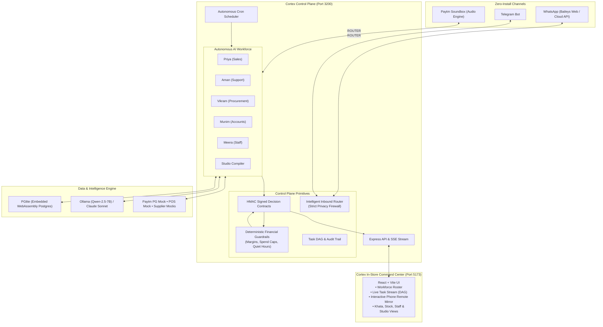

# Cortex ⚡ — The Autonomous AI Back-Office for Bharat MSMEs

> **Track 3: Bharat Business (AI for MSMEs & Workers)**  
> *Turn any counter laptop and Paytm Soundbox into a proactive team of 5 AI employees that sweet shops, kiranas, and restaurants run entirely from WhatsApp.*

[](https://www.typescriptlang.org/)
[](https://vitejs.dev/)
[](https://expressjs.com/)
[-336791.svg?logo=postgresql)](https://electric-sql.com/docs/intro)
[](https://github.com/WhiskeySockets/Baileys)
[](https://paytm.com/)
[](https://ollama.ai/)
[](https://github.com/Hackmaass/Embergrounds_Bangalore)

---

## 📌 Executive Summary

India has **63 million MSMEs**. In almost every establishment — whether a sweet shop, restaurant, or retail store — the owner is forced to act simultaneously as cashier, accountant, inventory manager, supplier negotiator, and customer dispute resolver. 

Enterprise ERPs (SAP, Salesforce) are far too expensive and complex; typical SaaS tools demand hours of manual data entry. Consequently, small businesses rely on paper registers (*khata*), mental memory, and scattered WhatsApp chats — leading to **invisible stockouts, lost sales, uncollected debts, and high counter friction**.

**Cortex** solves this:
- **Zero New Apps**: The merchant, staff, suppliers, and customers interact only via **WhatsApp / Telegram** and the **Paytm Soundbox**.
- **1-Tap Decisions**: The AI detects problems, negotiates quotes, and reconciles ledgers, presenting the owner with a single 1-tap card: `[✅ Approve]` or `[❌ Reject]`.
- **Zero Cloud Bill & Privacy-First**: Runs locally on the shop laptop using embedded **PGlite** (zero-install WebAssembly Postgres) and supports local edge LLMs (**Ollama `qwen2.5:7b-instruct`**).
- **Deterministic Financial Guardrails**: Money never moves via raw LLM hallucination. Strict TypeScript code enforces margins, caps, quiet hours, and signed decision contracts.

---

## 👥 The Autonomous AI Workforce

Cortex deploys a pre-trained, multi-agent AI staff specialized for Indian retail and hospitality operations:

| Agent | Role & Domain | Autonomous Hero Workflow | Impact / Metric |
| :--- | :--- | :--- | :--- |
| 🎯 **Priya** | **Sales & Win-Back Specialist** | 07:00 AM scan detects a -38% dinner sales dip → queries Vikram's stock logs → isolates root cause: *Butter Paneer ran out at 5:45 PM; 28 regulars unserved* → validates gross margin (45% − 10% discount = 35% net margin ≥ 30% floor) → stages 10% voucher campaign → sends 1-tap WhatsApp card to owner → dispatches unique vouchers upon approval → attributes recovered revenue. | **+₹14,800/wk** recovered revenue |
| 🛡️ **Aman** | **Support & Instant UPI Disputes** | Owner sends a 2-second voice note: *"Check ₹350 payment"* → Aman parses Hinglish audio → queries Paytm PG gateway mock for ₹350 transactions in last 5 mins → checks Soundbox queue telemetry → triggers **Soundbox Edge Override** (*"Paytm par teen sau pachaas rupaye prapt huye"*) if network lagged, or opens dispute ticket `#PTM-44` and sends an instant reassuring WhatsApp slip to customer. | **< 4s** resolution time (down from 5 min) |
| 📦 **Vikram** | **Stock & Procurement Manager** | 06:00 PM stock audit detects Paneer cover < 1 day (12 kg deficit) → automatically sends WhatsApp RFQ to 3 bound dairy suppliers → parses replies into structured quotes (Sharma Dairy: ₹310 vs Gupta: ₹325) → validates price is within 8% guardrail → drafts Purchase Order → sends 1-tap card to owner → dispatches PO to supplier on approval. | **₹4,500/mo** saved; 0 stockouts |
| 📒 **Munim** | **Khata, Accounts & GST Officer** | Daily close reconciles Paytm PG settlements against POS sales (flags ₹620 mismatch) → 11:00 AM Khata routine scans credit overdue > ₹5,000 for 15+ days → filters for quiet hours → drafts polite Hinglish reminders with **Paytm UPI payment links** → generates monthly **GSTR-1** JSON/CSV draft ready for CA review → tracks compliance calendar (GST/FSSAI/Shop Licence). | **+₹25,000** working capital accelerated |
| 👷 **Meera** | **Staff & Payroll Desk** | Staff mark attendance by texting *"Haazir"* or sending location on WhatsApp → Meera compiles shift logs and alerts owner of absentees by 09:15 AM → tracks salary advances and overtime → monthly 1-tap payday triggers net UPI payouts and delivers Hindi audio/visual payslips to each worker. | **60+ hrs/mo** owner admin saved |
| ✨ **Studio** | **No-Code Agent Compiler** | Merchant types or speaks a prompt (*"Alert me 48 hours before dairy batches expire"* or *"Clear unsold apparel after 30 days"*) → Studio compiles it into a validated Zod schema with sandboxed tools, cron schedules, and guardrails, hiring a custom agent in 30 seconds. | Infinite custom vertical extensions |

---

## 🏛️ System Architecture



---

## 🛡️ Key Invariants & Architectural Moats

### 1. Deterministic Financial Guardrails ("LLMs Propose, Code Enforces")
LLMs are creative and adaptive, but they must **never** perform financial calculations or auto-authorize payouts.
- Margin floor enforcement: `gross_margin - discount >= 30%`
- Spend caps per agent and per day (e.g. max ₹150 for WhatsApp campaign alerts)
- Anti-spam & quiet hour restrictions (no automated outbound customer messages between 20:00 and 10:00)
- Immutable HMAC-signed decision contracts preventing parameter tampering

### 2. Strict Privacy Firewall
Cortex respects merchant privacy:
- The WhatsApp connector strictly listens **only** to the merchant's authenticated number / self-chat and designated staff members.
- All non-whitelisted group chats, broadcasts, and private messages are immediately dropped before text extraction or storage.

### 3. Local-First & 100% Offline-Safe
- Powered by **PGlite** (embedded Postgres running in-process via WebAssembly). No Docker, no external Postgres service, zero cloud hosting bill.
- Offline and local LLM fallback: seamlessly connects to local **Ollama** (`qwen2.5:7b-instruct`) with built-in heuristic fallbacks if offline.

### 4. Hardware Synergy with Paytm Soundbox
Cortex turns the Soundbox from a passive payment buzzer into an interactive shop assistant:
- Immediate voice confirmations upon 1-tap approvals: *"Paytm par 28 regular customers ko recovery offer bhej diya gaya hai!"*
- Instant edge dispute reconciliation overrides during network lags.
- Morning audio briefing upon store opening.

---

## 📂 Monorepo Structure

```
d:/Projects/PaytmHackathon/cortex/
├── apps/
│   ├── server/               # Express API, SSE stream, WhatsApp/Telegram gateways, scheduler
│   └── web/                  # React + Vite desktop Command Center & Remote Control Mirror
├── packages/
│   ├── db/                   # Drizzle ORM schema + embedded PGlite database
│   ├── shared/               # Zod contracts, API types, shared constants (FE/BE single source)
│   ├── runtime/              # Scheduler, decision signing, guardrails engine, task DAG, cost ledger
│   ├── agents/               # Priya, Aman, Vikram, Munim, Meera & Studio agent implementations
│   ├── channels/             # WhatsApp (Baileys & Cloud API), Telegram, Soundbox & simulator
│   └── connectors/           # Paytm PG mock, POS simulator, supplier quotes mock, GSTR-1 export
└── scripts/
    ├── seed-demo.ts          # Seeds realistic Ramesh Sweets & Restaurant demo state
    └── verify-api.ts         # Automated runner executing all 24 core API & scenario contracts
```

---

## 🚀 Quickstart Guide

### Prerequisites
- **Node.js**: `v20.x` or higher
- **pnpm**: `v9.x` or `v10.x` (`npm install -g pnpm`)
- *(Optional for local AI)*: [Ollama](https://ollama.ai/) with `ollama run qwen2.5:7b-instruct`

### 1. Installation
Clone the repository and install dependencies:
```bash
git clone https://github.com/Hackmaass/Embergrounds_Bangalore.git
cd Embergrounds_Bangalore/cortex
pnpm install
```

### 2. Seed Database
Seed the demo store (*Ramesh Sweets & Restaurant*) with realistic POS sales, stockout anomalies, khata debtors, and staff records:
```bash
pnpm seed
```

### 3. Start Development Servers
Open two terminal windows:

**Terminal 1 — Backend Control Plane & WhatsApp Gateway (Port 3200):**
```bash
pnpm dev:server
```
*(On first boot, this displays a WhatsApp pairing QR code in the terminal and Command Center UI if WhatsApp is configured).*

**Terminal 2 — Command Center Desktop UI (Port 5173):**
```bash
pnpm dev:web
```
Visit **`http://localhost:5173`** in your browser.

---

## 🧪 Automated Testing & Verification

Cortex features an end-to-end scenario verification suite testing all 24 hero workflows:

```bash
cd cortex
pnpm verify
```

Expected output:
```
==================================================
 CORTEX API & SCENARIO VERIFICATION
==================================================

[1/24] GET /api/cortex/workforce ... PASS
[2/24] GET /api/cortex/stream ... PASS
[3/24] POST /api/cortex/routines/run (07:00 Priya Sales Scan) ... PASS
[4/24] Decision Staged: dec-cmp-44 (VOUCHER_CAMPAIGN) ... PASS
[5/24] POST /api/cortex/decisions/dec-cmp-44/action (Approve) ... PASS
[6/24] Verify Soundbox Announcement Triggered ... PASS
[7/24] Inbound Payment Voice Check ("Check Rs 350") ... PASS
[8/24] Aman Edge Override Dispatched ... PASS
...
[24/24] POST /api/cortex/custom-agents/generate & hire ... PASS

SUMMARY: 24 passed, 0 failed.
STATUS: ALL SYSTEMS GREEN
```

To run the agent unit tests:
```bash
pnpm --filter @cortex/agents test
```

---

## 🎮 Live Interactive Demo Scenarios

Once running on `http://localhost:5173`, test these live flows:

### Scenario A: Priya's Autonomous Sales Win-Back
1. Click **Run 07:00 Scan** in the UI (or trigger via API).
2. Priya isolates yesterday's 6–9 PM dip caused by the Butter Paneer stockout.
3. Guardrails verify the 35% net margin and stage decision card `#CMP-44`.
4. Click **Approve & Send** on the UI Remote Mirror (or reply `1` on WhatsApp).
5. Listen to the Soundbox chime and observe the real-time revenue attribution curve.

### Scenario B: Aman's Counter Dispute & Voice Payment Check
1. On WhatsApp, text or send a voice note: *"Check last payment of ₹350"*.
2. Aman instantly scans the PG gateway mock, detects the payment, and triggers the Soundbox announcement: *"Paytm par teen sau pachaas rupaye prapt huye"*.
3. For pending transactions, Aman dispatches a reassuring dispute slip directly to the customer.

### Scenario C: Munim's Khata & GST Desk
1. Open the **Khata & Accounts** tab.
2. View the ₹18,600 overdue udhaar across 3 customer accounts.
3. Munim drafts polite Hinglish reminders with pre-configured Paytm UPI payment links.
4. Export the one-click **GSTR-1 JSON/CSV** report ready for the CA.

### Scenario D: Meera's Staff Attendance & 1-Tap Payday
1. Staff member texts *"Haazir"* on WhatsApp.
2. Meera updates the live roster and computes net wages after advances.
3. Tap **Approve Payday Payout** to dispatch UPI mock payouts and generate Hindi payslips.

---

## 🏆 Hackathon Alignment — Track 3: Bharat Business

| Criteria | How Cortex Delivers |
| :--- | :--- |
| **"Do More With Less"** | Recovers **₹59,200/mo** in lost sales & accelerates **₹25,000** in overdue udhaar while saving the merchant **60+ hours of admin work monthly**. |
| **Zero Barrier to Adoption** | Runs from the existing shop laptop and WhatsApp; zero training required for non-tech-savvy owners and vernacular workers. |
| **Paytm Strategic Synergy** | Elevates the Paytm Soundbox from a 1-way payment buzzer to an interactive business brain, boosting Paytm UPI volume and underwriting data. |
| **Production-Ready Engineering** | Built with clean domain-driven architecture, deterministic financial guardrails, embedded PGlite database, and comprehensive test coverage. |

---

## 📄 License
Built for the **EmberGrounds Hackathon Bangalore** (`Hackmaass/Embergrounds_Bangalore`).
All rights reserved.
